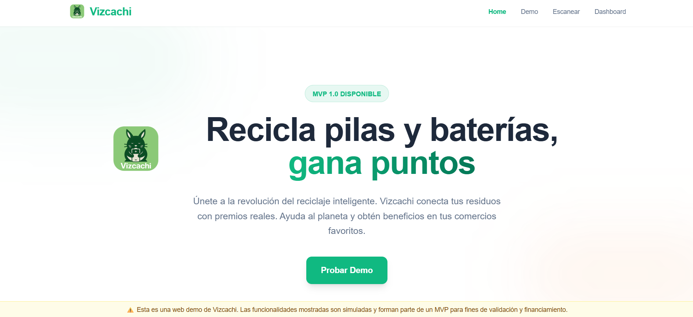

# Vizcachi - MVP Reciclaje de Baterías

Esta es una demostración técnica (MVP) de **Vizcachi**, una plataforma para la gestión y visualización de puntos de reciclaje de pilas y baterías domiciliarias.

## Screenshot

## Características (Demo)
- 🗺️ **Mapa Interactivo**: Visualización de puntos de recolección en Buenos Aires usando OpenStreetMap + Leaflet.
- 📱 **Diseño Responsive**: Interfaz adaptada a móviles y escritorio con Tailwind CSS.
- 🔋 **Datos Simulados**: Muestra de capacidad y ubicación de contenedores (Mock Data).

## Stack Tecnológico
- **Frontend**: React 18 + TypeScript + Vite
- **Estilos**: Tailwind CSS
- **Mapas**: Leaflet + React Leaflet

## Notas para la Demo
- Esta versión utiliza datos estáticos (`src/data/mockLocations.ts`).
- No requiere backend ni base de datos real.
- Diseñada para presentar a inversores/fondos públicos.

## Autor
**JavGarin**
